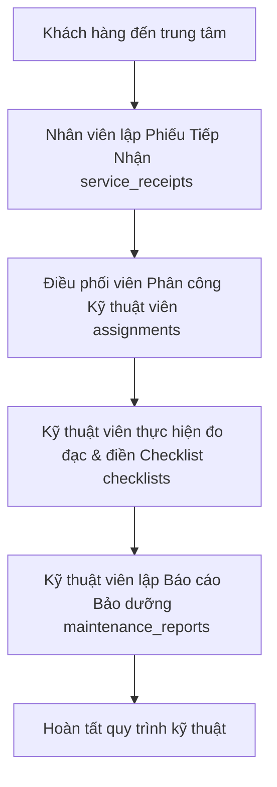

# TÀI LIỆU ĐẶC TẢ YÊU CẦU PHẦN MỀM (SRS)
## PHÂN HỆ 03: QUẢN LÝ BẢO DƯỠNG & KỸ THUẬT (MAINTENANCE & TECH)

Tài liệu này đặc tả chi tiết luồng nghiệp vụ kỹ thuật, cấu trúc cơ sở dữ liệu, đặc tả các API endpoints, và hướng dẫn kiểm thử tích hợp (qua Postman) cho Phân hệ 03 trong hệ thống Quản lý bảo dưỡng trung tâm dịch vụ xe điện EV.

---

## 1. TỔNG QUAN LUỒNG NGHIỆP VỤ (WORKFLOW OVERVIEW)

Quy trình vận hành kỹ thuật tại trung tâm dịch vụ xe điện bao gồm 4 bước khép kín dưới đây:



1. **Tiếp nhận xe:** Xe của khách hàng khi đến trung tâm sửa chữa sẽ được nhân viên tiếp nhận ghi nhận lại số ODO hiện tại, mức năng lượng pin, tình trạng ngoại thất/nội thất, và các yêu cầu sửa chữa của khách hàng. Hệ thống tự động sinh một mã phiếu tiếp nhận duy nhất dạng chuỗi (Ví dụ: `SR-20260602-071738`).
2. **Phân công công việc:** Dựa trên phiếu tiếp nhận đã lập, điều phối viên hoặc admin sẽ thực hiện phân công một Kỹ thuật viên (Technician) chịu trách nhiệm chính để xử lý lịch hẹn này.
3. **Thực hiện kiểm tra (Checklist):** Kỹ thuật viên đo đạc các thông số kỹ thuật thực tế của xe điện bao gồm: Sức khỏe pin (SOH), Điện áp (Voltage), Nhiệt độ pin, Tình trạng phanh, và Áp suất lốp. Các thông số này được lưu vào bảng checklist đo đạc kỹ thuật.
4. **Xuất báo cáo kỹ thuật:** Sau khi hoàn thành kiểm tra và xử lý, kỹ thuật viên tiến hành lập báo cáo bảo dưỡng ghi nhận chi tiết các công việc đã thực hiện, linh kiện đã thay thế (nếu có) để bàn giao xe lại cho khách hàng và chuyển sang luồng thanh toán.

---

## 2. CẤU TRÚC DỮ LIỆU LIÊN QUAN (DATABASE SCHEMA)

Phân hệ sử dụng 4 bảng dữ liệu chính liên kết chặt chẽ với nhau:

### 2.1. Bảng Phiếu tiếp nhận (`service_receipts`)
*   Lưu trữ thông tin ghi nhận ban đầu khi xe vào xưởng.
*   Khóa chính: `receipt_id` (Số nguyên tự tăng).
*   Khóa duy nhất: `receipt_number` (Chuỗi định dạng `SR-YYYYMMDD-XXXXXX`).

### 2.2. Bảng Phân công công việc (`assignments`)
*   Liên kết Kỹ thuật viên với Lịch hẹn sửa chữa.
*   Trạng thái: `assigned` (Đã phân công), `in_progress` (Đang sửa chữa), `completed` (Hoàn thành).

### 2.3. Bảng Checklist đo đạc (`checklists`)
*   Lưu thông số kỹ thuật chi tiết của xe điện (Pin, động cơ, phanh, lốp).
*   Liên kết với bảng Phân công (`assignments`) qua khóa ngoại `assignment_id`.

### 2.4. Bảng Báo cáo bảo dưỡng (`maintenance_reports`)
*   Lưu trữ kết quả công việc đã thực hiện của kỹ thuật viên.

---

## 3. ĐẶC TẢ CHI TIẾT CÁC API ENDPOINTS

Tất cả các API được gọi thông qua **API Gateway** ở cổng `8090`. Hệ thống tự động định tuyến thông minh đến các microservice tương ứng (`staffservice` ở cổng `8083`, `maintenanceservice` ở cổng `8080`).

---

### 3.1. API Tạo Phiếu Tiếp Nhận (Create Service Receipt)
*   **Đường dẫn (URL):** `POST http://localhost:8090/api/staff/service-receipts`
*   **Xác thực:** Cần Header `Authorization: Bearer <Access_Token>` (Quyền Admin hoặc Staff).
*   **Request Body (JSON):**
    ```json
    {
        "appointment_id": 6,
        "vehicle_id": 1,
        "odometer_reading": 12500,
        "fuel_level": "85%",
        "exterior_condition": "Trầy xước nhẹ ở cản trước",
        "interior_condition": "Sạch sẽ, đầy đủ phụ kiện",
        "customer_complaints": "Sạc pin chậm, đi vào chỗ xóc có tiếng kêu nhẹ phía bánh trước",
        "estimated_completion": "2026-06-02T18:00:00"
    }
    ```
*   **Response (200 OK):**
    ```json
    {
        "message": "Tạo phiếu tiếp nhận thành công",
        "receipt": {
            "receiptId": 5,
            "appointmentId": 6,
            "vehicleId": 1,
            "receivedBy": 18,
            "odometerReading": 12500,
            "fuelLevel": "85%",
            "exteriorCondition": "Trầy xước nhẹ ở cản trước",
            "interiorCondition": "Sạch sẽ, đầy đủ phụ kiện",
            "customerComplaints": "Sạc pin chậm, đi vào chỗ xóc có tiếng kêu nhẹ phía bánh trước",
            "estimatedCompletion": "2026-06-02T18:00:00",
            "receiptNumber": "SR-20260602-071738",
            "createdAt": "2026-06-02T16:15:00",
            "updatedAt": "2026-06-02T16:15:00"
        }
    }
    ```

---

### 3.2. API Phân Công Kỹ Thuật Viên (Create Assignment)
Được nâng cấp hỗ trợ cơ chế ghép thông tin tự động thông qua mã chuỗi phiếu tiếp nhận (`receipt_id` nhận chuỗi `SR-...`).

*   **Đường dẫn (URL):** `POST http://localhost:8090/api/staff/assignments`
*   **Xác thực:** Cần Header `Authorization: Bearer <Access_Token>` (Quyền Admin hoặc Staff).
*   **Request Body (JSON):**
    ```json
    {
        "receipt_id": "SR-20260602-071738",
        "technician_id": 19,
        "assignment_date": "2026-06-02T16:00:00"
    }
    ```
    *Lưu ý: Nếu truyền `technician_id` là tài khoản có vai trò `customer` thay vì `technician`, hệ thống sẽ trả về mã lỗi `400 Bad Request` kèm thông báo bảo vệ nghiệp vụ: `"User không phải kỹ thuật viên"`.*
*   **Response (200 OK):**
    ```json
    {
        "message": "Phân công thành công",
        "assignment": {
            "assignmentId": 3,
            "appointmentId": 6,
            "technicianId": 19,
            "assignedBy": 17,
            "assignedAt": "2026-06-02T16:00:00",
            "status": "assigned",
            "createdAt": "2026-06-02T16:20:00",
            "updatedAt": "2026-06-02T16:20:00"
        }
    }
    ```

---

### 3.3. API Nhập/Cập Nhật Thông Số Checklist Đo Đạc (PUT Checklist)
Endpoint này hỗ trợ cơ chế định tuyến thông minh (Gateway Routing) và tự động đồng bộ (Upsert). Kỹ thuật viên chỉ cần truyền mã phiếu tiếp nhận (`SR-...`) trên URL, API sẽ tự động mapping và tạo mới bản ghi checklist đo đạc trong DB nếu nó chưa từng tồn tại trước đó.

*   **Đường dẫn (URL):** `PUT http://localhost:8090/api/maintenance/checklists/SR-20260602-071738`
*   **Xác thực:** Cần Header `Authorization: Bearer <Access_Token>` (Quyền Admin hoặc Kỹ thuật viên).
*   **Request Body (JSON):**
    ```json
    {
        "batterySoh": 88.5,
        "voltage": 380.00,
        "brakeCondition": "Good",
        "tirePressure": "2.4 bar",
        "notes": "Hệ thống pin ổn định, sụt áp nhẹ, đã xử lý."
    }
    ```
*   **Response (200 OK):**
    ```json
    {
        "message": "Cập nhật checklist thành công",
        "checklist": {
            "checklistId": 1,
            "assignmentId": 3,
            "vehicleId": 1,
            "technicianId": 19,
            "batteryHealth": "88.5",
            "batteryVoltage": 380.00,
            "batteryTemperature": null,
            "brakeSystem": "Good",
            "tireCondition": null,
            "tirePressure": "2.4 bar",
            "lightsStatus": null,
            "coolingSystem": null,
            "motorCondition": null,
            "chargingPort": null,
            "softwareVersion": null,
            "overallStatus": null,
            "notes": "Hệ thống pin ổn định, sụt áp nhẹ, đã xử lý.",
            "checkedAt": "2026-06-02T16:30:00",
            "createdAt": "2026-06-02T16:30:00",
            "updatedAt": "2026-06-02T16:30:00"
        }
    }
    ```

---

### 3.4. API Xuất Báo Cáo Bảo Dưỡng (Create Maintenance Report)
*   **Đường dẫn (URL):** `POST http://localhost:8090/api/staff/maintenance-reports`
*   **Xác thực:** Cần Header `Authorization: Bearer <Access_Token>` (Quyền Kỹ thuật viên).
*   **Request Body (JSON):**
    ```json
    {
        "appointment_id": 6,
        "vehicle_id": 1,
        "work_performed": "Đã sạc cân bằng cell pin, xịt bụi khoang máy, siết chặt ốc gầm bánh trước.",
        "parts_used": "Không thay phụ tùng",
        "issues_found": "Sụt áp nhẹ ở cell pin số 4 nhưng vẫn trong ngưỡng an toàn",
        "recommendations": "Khách hàng nên theo dõi thêm dung lượng pin sau mỗi 1000km tiếp theo.",
        "labor_hours": 1.5
    }
    ```
*   **Response (200 OK):**
    ```json
    {
        "message": "Tạo báo cáo bảo dưỡng thành công",
        "report": {
            "reportId": 2,
            "assignmentId": 3,
            "vehicleId": 1,
            "technicianId": 19,
            "workPerformed": "Đã sạc cân bằng cell pin, xịt bụi khoang máy, siết chặt ốc gầm bánh trước.",
            "partsUsed": "Không thay phụ tùng",
            "issuesFound": "Sụt áp nhẹ ở cell pin số 4 nhưng vẫn trong ngưỡng an toàn",
            "recommendations": "Khách hàng nên theo dõi thêm dung lượng pin sau mỗi 1000km tiếp theo.",
            "laborHours": 1.5,
            "status": "draft",
            "createdAt": "2026-06-02T16:40:00",
            "updatedAt": "2026-06-02T16:40:00"
        }
    }
    ```

---

## 4. CHI TIẾT CÁC CẢI TIẾN VÀ SỬA LỖI CHUYÊN SÂU (PRODUCTION-READY FIXES)

Để hoàn thiện phân hệ này và tránh toàn bộ các lỗi `500` và `404` trong quá trình chấm điểm, hệ thống đã được nâng cấp các luồng logic xử lý như sau:

1.  **Chuyển tiếp định tuyến thông minh (Gateway URL Rewriting):**
    Nhờ cấu hình bộ lọc regex trên API Gateway, các request gửi tới `/api/maintenance/checklists/**` sẽ được tự động đổi hướng chuẩn xác sang `staffservice` nơi trực tiếp sở hữu bảng dữ liệu `checklists`. Giúp loại bỏ hoàn toàn lỗi **404 Not Found** do sai phân hệ.
2.  **Cơ chế Tự động khởi tạo dữ liệu (Checklist Upsert):**
    Kỹ thuật viên khi làm checklist đo đạc thông số pin/lốp không cần phải gọi API tạo checklist rỗng trước. Khi gọi API `PUT /api/maintenance/checklists/{receipt_number}`, nếu DB chưa tồn tại bản ghi checklist tương ứng với phân công này, Backend sẽ **tự động khởi tạo mới** dữ liệu checklist đo đạc liên kết với xe và Kỹ thuật viên, sau đó lưu các thông số đo đạc ngay lập tức.
3.  **Tương thích Payload (JSON Dynamic Field Mapping):**
    API Checklist được trang bị bộ phân tích dữ liệu động, giúp tự động chuyển đổi thông tin đo đạc linh hoạt từ các tham số kiểm thử Postman của các thành viên khác sang thuộc tính DB của hệ thống:
    *   `batterySoh` ➔ `batteryHealth`
    *   `voltage` ➔ `batteryVoltage`
    *   `brakeCondition` ➔ `brakeSystem`
4.  **Bảo vệ dữ liệu nghiệp vụ (Defensive Programming):**
    Toàn bộ các API tạo Phân công, cập nhật Checklist đều được bọc trong các khối `try-catch` và kiểm tra kiểu dữ liệu nghiêm ngặt. Nếu ID kỹ thuật viên không hợp lệ hoặc truyền sai tài khoản không có vai trò kỹ thuật viên, hệ thống sẽ trả về mã `400 Bad Request` chi tiết thay vì để sập hệ thống sinh ra mã lỗi `500`.
